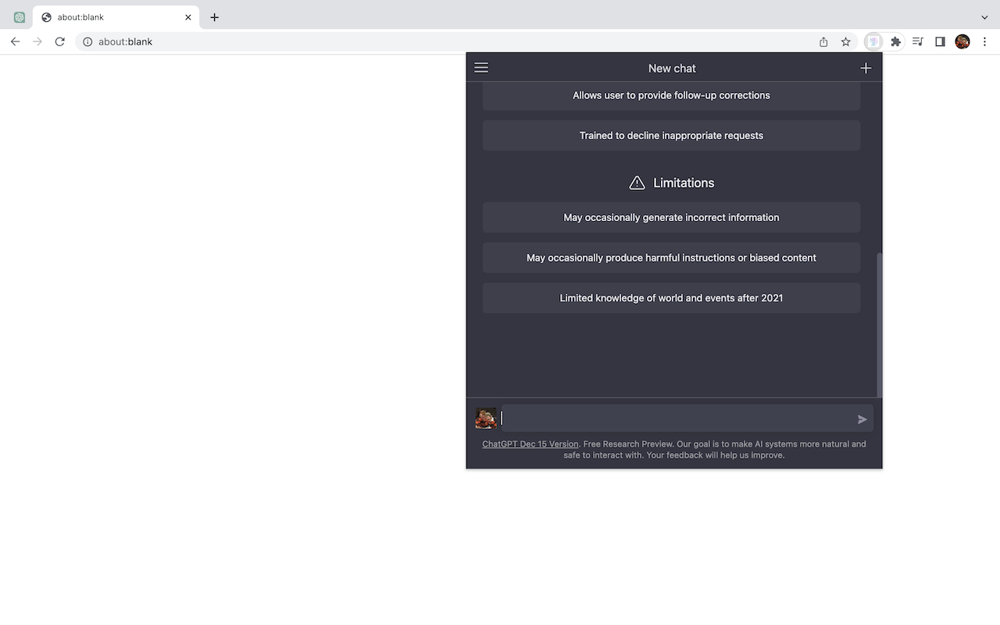
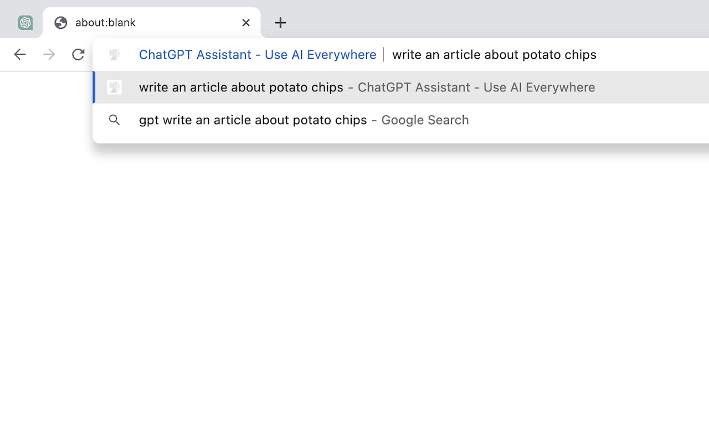
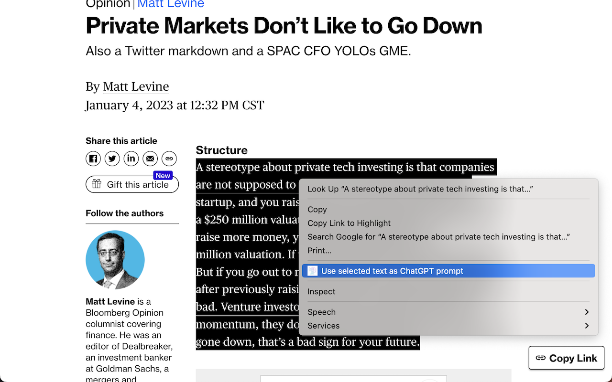
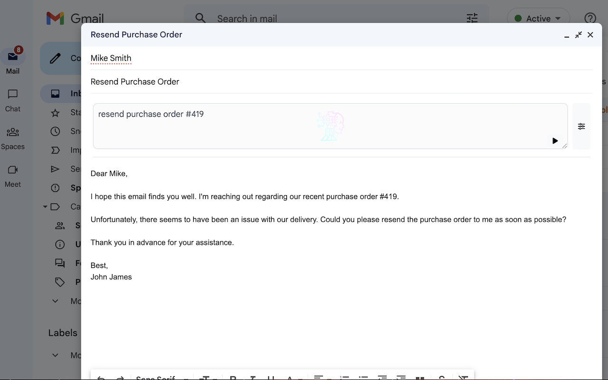
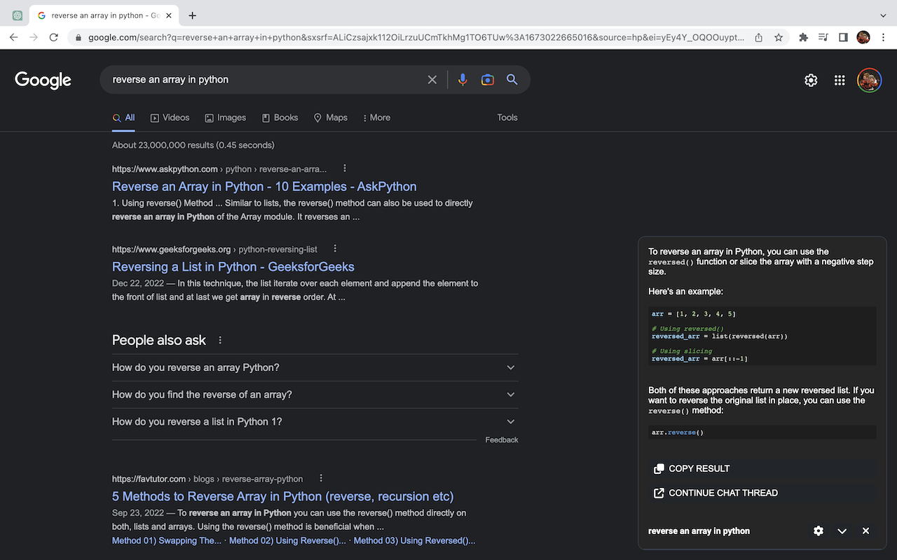

# ChatGPT-Assistant-Browser-Extension
ChatGPT Assistant is a powerful browser extension that seamlessly integrates ChatGPT into your daily browsing experience. ChatGPT Assistant is a powerful browser extension that seamlessly integrates ChatGPT into your daily browsing experience. Access ChatGPT directly from context menus, the omnibar, and other browser interfaces, making it easier than ever to leverage AI assistance.

|       |
| :--------------------------------------------------------: |
| _Quickly access ChatGPT with the Ctrl + Shift + K command_ |

|                       |
| :--------------------------------------------------------------------------: |
| _Type "gpt" + space in the omnibox to send ChatGPT prompts from the omnibox_ |

|  |
| :----------------------------------------------------------------: |
|    _Select text and right click to send it as a ChatGPT prompt_    |

|  |
| :----------------------------------------------------: |
|      _Use ChatGPT to compose and reply to email_       |

|  |
| :------------------------------------------------------: |
|  _Automatically send search engine queries as prompts_   |

## Features
### 📋 Right-Click Context Menu
- Highlight text anywhere in your browser, right-click, and instantly send it to ChatGPT as a prompt.
- Great for summarizing articles, answering questions, or rephrasing selected text.
### 🔍 Browser Omnibar
- Type gpt + space in the browser's omnibox to send a ChatGPT prompt without leaving the page.
- Perfect for quick queries on the go.
### 💬 Extension Popup
- Use the Ctrl + Shift + K shortcut (or equivalent on Mac) to quickly open a popup and chat with ChatGPT anytime.
- Fast, convenient access without navigating away from your current tab.
### 📨 Email Assistance
- Compose or reply to emails using ChatGPT directly in your email client.
- Streamline your communication with AI-generated content suggestions.
### 🌐 Search Engine Integration
- Automatically send search engine queries (e.g., Google, Bing) as prompts to ChatGPT.
- Get AI-powered answers alongside traditional search results.

## Installation
🛠 Install from Chrome Web Store
Install the extension directly from the Chrome Web Store or Edge Add-ons Store:
ChatGPT Assistant on Chrome Web Store

## ⚙️ Local Installation
1. Download the latest release from the Releases Page.
2. Unzip the downloaded file.
3. Open your browser's extensions page:
- For Chrome: Go to chrome://extensions
- For Edge: Go to edge://extensions
4. Enable Developer Mode.
5. Drag and drop the unzipped folder onto the extensions page.
6. Enjoy using the ChatGPT Assistant extension!

## 🔧 Build from Source
1. Clone the repo
2. Install dependencies with `yarn`
3. Run `npm run start`
4. Load the `dist` directory to your browser

## Special Configuration for Brave Browser
For Brave users, make sure to disable fingerprinting protections for the extension to work correctly:

- Navigate to brave://settings/shields.
- Disable "Prevent sites from fingerprinting me based on my language preferences".

## Usage Guide
- Highlight any text → Right-click → Select "Send to ChatGPT" → View the response.
- Click on the browser’s address bar.
- Type gpt followed by a space, then your prompt.
- Press Enter to see ChatGPT's response.
- Use the Ctrl + Shift + K (or Cmd + Shift + K on Mac) shortcut.
- Type your prompt and receive instant responses.
